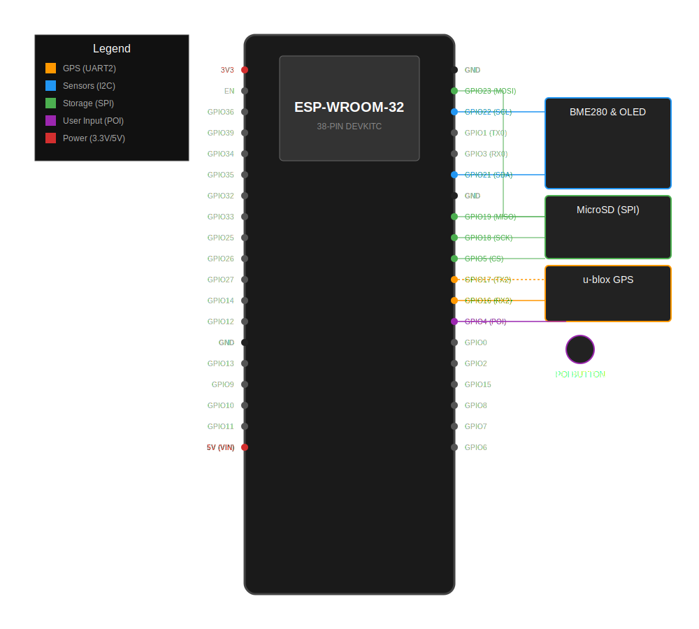

# Hardware Specifications

## ESP32 DevKit V1 (30-pin) Pinout
This project uses an ESP-WROOM-32 30-pin development board. All connections use **GPIO numbers**.

| Component | Interface | ESP32 GPIO | Physical Pin | Notes |
| :--- | :--- | :--- | :--- | :--- |
| **u-blox M8030** | UART2 TX | **17** | 26 | Data to GPS (Optional) |
| **u-blox M8030** | UART2 RX | **16** | 27 | Data from GPS |
| **I2C Bus** | SDA | **21** | 22 | Shared: BME280, SSD1306 |
| **I2C Bus** | SCL | **22** | 19 | Shared: BME280, SSD1306 |
| **MicroSD** | SPI MOSI | **23** | 18 | VSPI |
| **MicroSD** | SPI MISO | **19** | 23 | VSPI |
| **MicroSD** | SPI SCK | **18** | 24 | VSPI |
| **MicroSD** | SPI CS | **5** | 25 | VSPI |
| **POI Button** | Input | **4** | 28 | Interrupt driven, Internal Pull-up |

## Sensors & Peripherals
*   **GNSS:** u-blox M8030 configured for 10Hz UBX-PVT.
*   **Environmental:** BME280 for temperature, pressure, and humidity.
*   **Display:** SSD1306 128x64 OLED.
*   **Storage:** FATFS over MicroSD (SPI).

## Wiring Diagram

